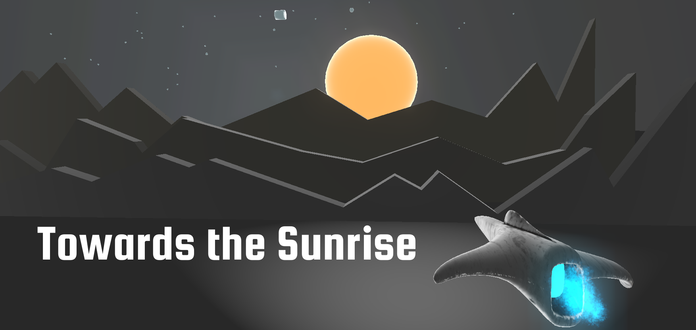

# Towards The Sunrise

Towards the Sunrise draws inspiration from arcade games like ["Race the Sun (2013)"](https://en.wikipedia.org/wiki/Race_the_Sun_(video_game)), emphasizing high scores, brief gaming sessions, and an infusion of pure enjoyment combined with exhilarating tension. The premise is straightforward: avoid collisions and keep soaring!

### [Get it in itch.io](https://alexnottaben.itch.io/towards-the-sunrise)

## Open Source Engine
The game is made using [Godot Engine 3.5.3 LTS](https://godotengine.org/). It may not work in 4.0+ and will not be ported anytime soon (if ever).

## Download
### Official builds:
- GNU/Linux
- Microsoft Windows

### Build from sources
To get the latest version of the game, you'll need to use the source code and the Godot Engine.

- Download and install [Godot Engine](https://godotengine.org/download) version 3.5.3 (4.0+ is not supported).
- Download our sources.
  - Download [master.zip](https://github.com/AlexNottaBen/Towards-The-Sunrise/archive/master.zip) and unzip or clone the repository using "git clone"
- Open Godot and import the game
- Enjoy! :)

Follow [this link](http://docs.godotengine.org/en/latest/learning/workflow/export/exporting_projects.html) to learn how to export the game for each platform.

## Credits
### Game Development:
- Alexander Serhiienko (alias AlexNottaBen) (https://github.com/AlexNottaBen/)

### 3D Models
- Hand Glider by Vincent Decc (https://sketchfab.com/VincentDecc),
- Lowpoly Mushrooms by Janosch (https://sketchfab.com/JanoschABR),
- Light Test 4 - Sunrise by Tycho Magnetic Anomaly (Leave Mr. Camera Alone) (https://sketchfab.com/Tycho_Magnetic_Anomaly):
    - License: CC-BY-4.0 (http://creativecommons.org/licenses/by/4.0/)

### Sprites and Particles
- Particle Pack by Kenney (https://www.kenney.nl/assets/particle-pack),
    - License: CC-0 (https://creativecommons.org/share-your-work/public-domain/cc0/)

### Music
- "Equatorial Complex " Kevin MacLeod (incompetech.com),
- "The Lift " Kevin MacLeod (incompetech.com):
    - License: CC-BY-4.0 (http://creativecommons.org/licenses/by/4.0/)

### Sound Effects
- SoundDesignForYou (https://freesound.org/people/SoundDesignForYou/):
    - License: CC-0 (https://creativecommons.org/publicdomain/zero/1.0/)

- newlocknew (https://freesound.org/people/newlocknew/),
- AUDACITIER (https://freesound.org/people/AUDACITIER/):
    - License: CC-BY-4.0 (https://creativecommons.org/licenses/by/4.0/)

### Fonts
- Squada One by Admix Designs (http://www.admixdesigns.com/),
- Open Sans by The Open Sans Project Authors (https://github.com/googlefonts/opensans):
    - License: SIL Open Font License, Version 1.1 (https://opensource.org/license/ofl-1-1/)

### Open Source Frameworks:
- Godot Engine (https://godotengine.org/)

### Special Thanks:
- The Godot community for providing help and resources.

## License
"Towards The Sunrise" is free and open source. It is available under the [copyleft](https://www.gnu.org/copyleft/)-style [GPLv3+](https://www.gnu.org/licenses/gpl-3.0.html) license (see the [LICENSE](LICENSE) file for details).
